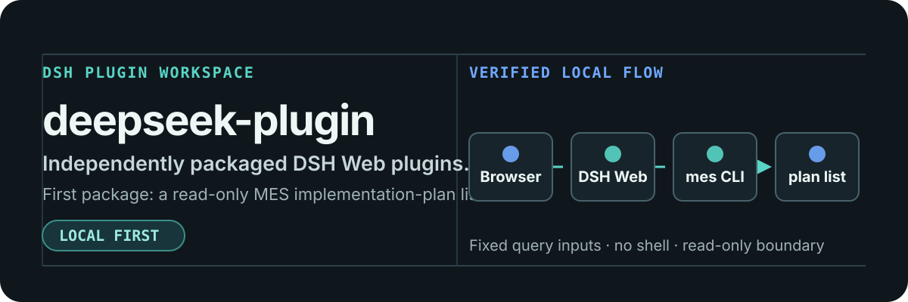

# deepseek-plugin

[English](./README.md) | 简体中文

<p align="center">
  
</p>

`deepseek-plugin` 是一个工作区，用于独立打包的 DSH Web 插件。第一个插件
`mes-plan-list` 按日期范围和状态展示 MES 实施计划，全部通过你本机已装的
`mes` CLI 完成。

## 第一个插件：`mes-plan-list`

插件在 DSH Web 侧边栏加入**实施计划**入口，并在 `/plugins/mes-plan-list` 提供
页面，向本机 DSH Web 的同源接口发起查询。它接受一个日期范围（手工填写，或用
最近 7/30/90 天快捷按钮设定），以及状态与合同类型的任意组合，列出计划 ID、
计划标题、客户、合同类型、执行人、该窗口期内的报工工时、计划开始与结束日期、
进行状态。

结果来自本地缓存，因此重复查询是瞬时的；**同步最新数据**会重新从 MES 取。
所有匹配的计划都会返回——Host 会翻页取全，而不是截断。

**已逾期未结束**的计划还可以按执行人汇总，在显式预览并确认后发送纯文本风险交底
邮件。绝不存在后台自动发送。SMTP、钥匙串与邮箱映射的配置见
[插件 README](./plugins/mes-plan-list/README.md#overdue-risk-email-reminders)。

## 本地安装

### 前置条件

- **Node 24 或更高**。插件的缓存使用内置的 `node:sqlite` 模块，更早的版本没有
  这个模块。开发与 CI 都在 24 上运行。
- **pnpm**，用于 `pnpm register` 和测试。
- **DSH** 且已有 `web` profile——如果从未启动过，先执行一次
  `dsh --profile web`，让 profile 存在。
- **`mes` CLI** 且已登录。可用 `mes auth status` 检查；未登录时插件会显示提示条
  并且查询会失败。

### 安装

```sh
git clone https://github.com/HuangChenning/deepseek-plugin.git
cd deepseek-plugin
pnpm register
```

这会写入 profile 的依赖项、`dsh.profile.bundles` 条目（正是它让 DSH 真正加载
插件）以及 `node_modules` 软链。该命令是幂等的，并且避开了 `dsh plugin add`
覆盖整个 profile 的 pnpm install——只要 profile 里有任何一个无关包违反供应链
策略，那条路就会失败。

运行工作区测试，然后启动 DSH Web：

```sh
pnpm test
dsh --profile web --no-open
```

打开 <http://127.0.0.1:3080>，点击侧边栏的**实施计划**。提交表单会调用你本机的
MES CLI；本仓库不包含、也不声称包含任何真实的 MES 查询结果。

### 更新

在插件页面使用**设置 → 插件版本 → 检查更新**，它会在这个克隆里执行
`git pull --ff-only`。等价的终端命令：

```sh
git pull --ff-only
```

两种方式都需要在之后**重启 DSH**，新代码才会被加载。插件不发布到 npm，也不进
DSH 插件市场；本仓库是唯一来源。

### 本地数据

查询结果缓存在每台机器自己的 SQLite 数据库里，位置是
`~/.dsh/storages/mes-plan-list/plans.db`，在你第一次查询时创建。它不会离开本机，
也不属于本仓库。插件的设置面板会显示缓存覆盖的范围，并可清空。

邮件提醒的数据——SMTP 设置、执行人邮箱映射和发送历史——存在**另一个**数据库
`~/.dsh/storages/mes-plan-list/mail.db` 里，因此清空计划缓存不会连带删除它们。
SMTP 密码只存在 macOS 钥匙串中。两者都不属于本仓库。

工时只按你查询的日期范围拉取。**「同步最新数据」会强制重新拉取报工记录，
因此较慢。** 报工数量比计划高出大约一个数量级，同步一个月大约需要一分钟。
如果普通查询的日期范围尚无工时缓存，插件也会首次自动补齐该范围；之后的重复查询
直接读取缓存。表格因此会显示实际工时或 `0`，而不是 `—`。

## 筛选条件

| 状态 | | 合同类型 | |
| --- | --- | --- | --- |
| `0` | 未开始 | `0` | 巡检 |
| `1` | 进行中 | `1` | 培训 |
| `3` | 已逾期未结束 | `2` | 现场人天 |
| | | `3` | 驻场 |
| | | `4` | 售前POC |
| | | `5` | 维保 |
| | | `6` | 内部事项 |

已结束（`2`）的计划一律不显示，也没有对应的筛选项。

计划只要与查询窗口**有交集**就会列出，而不必整个落在窗口内——MES 自身的过滤只支持
后者，那会让一个 5 月到 8 月的计划在 8 月的查询里消失，也会因为「进行中」的计划结束
日期在未来而把它们整类漏掉。

因此同步取的是**全部**计划而不是你查询的范围，本地数据库是一份完整副本。之后任何
窗口、任何筛选组合都在本地即时完成，不存在「缓存范围够不够」这个问题。

MES 自身无法组合多个值——`--status 2,3` 返回空，`--check-type` 只接受单个整数
——因此筛选是在本地缓存上完成的，缓存里存的是整个窗口的数据。

## 工作区结构

```text
.
├── assets/readme/          # 仓库 README 视觉素材
├── plugins/
│   └── mes-plan-list/      # 包、patch、源码、测试与用法说明
├── scripts/                # profile 注册
├── CHANGELOG.md
├── package.json
└── pnpm-workspace.yaml
```

每个插件拥有自己的依赖、源码、测试、patch 配置和 README。根包只负责工作区级别的
命令；在两个插件出现稳定且经过测试的共同需求之前，不引入共享包。

## 只读边界

`mes-plan-list` 不创建、不修改、不删除、不导出，也不以任何方式改动 MES 计划。
Host 会校验允许的字段，并以固定的进程参数调用本机 `mes` 二进制——绝不经过
shell——因此浏览器输入无法塞进另一个 CLI 参数。

邮件提醒是唯一会把数据发出本机的功能，但它仍在这条边界内：只读取计划，不回写，
既不关闭计划也不读取收件箱。每次发送都必须经过预览和显式确认，且服务端会在第一
封邮件发出之前，再次向 MES 核验每条计划的状态。

发布历史见 [CHANGELOG.md](./CHANGELOG.md)；插件自身的工作流（设置、登录状态、
CLI 更新，以及缓存如何决定要重新取什么）见
[`plugins/mes-plan-list/README.md`](./plugins/mes-plan-list/README.md)。
